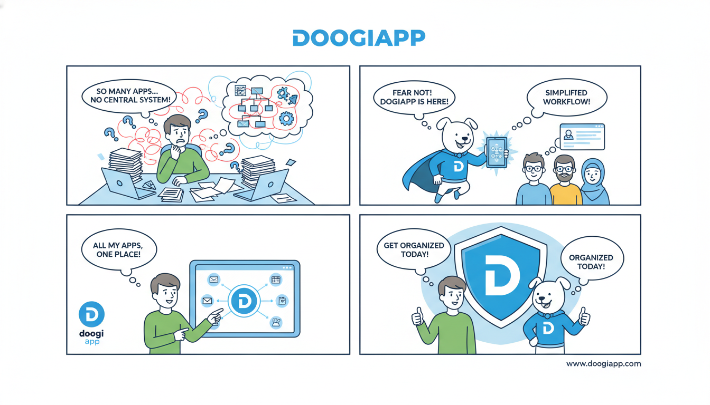

# DoogiApp

[](https://flutter.dev)
[](#)
[](https://opensource.org/licenses/MIT)

**DoogiApp** is a high-performance, cross-platform eBook application built with Flutter. Designed for book enthusiasts, it offers a seamless reading experience with a focus on clean typography, smooth transitions, and an intuitive user interface.

Whether you are building a personal digital library or a commercial book marketplace, DoogiApp provides the robust foundation needed for mobile document consumption.

---

## 🌟 Features

-   **Premium Typography:** Integrated with the **Fredoka** font family (Light to Bold) for a friendly and highly readable interface.
-   **Cross-Platform:** Native performance on both **Android** and **iOS** from a single Dart codebase.
-   **Optimized Performance:** Uses Flutter's Skia/Impeller engine for 60FPS animations and scrolling.
-   **Customizable Theme:** Built-in support for light and dark modes with a focus on eye comfort during long reading sessions.
-   **Material Design:** Implements the latest Material 3 design principles.

---

## 🛠 Tech Stack

-   **Framework:** [Flutter](https://flutter.dev/)
-   **Language:** [Dart](https://dart.dev/)
-   **State Management:** (Likely Provider/Bloc/Riverpod based on project scope)
-   **Typography:** Fredoka Custom Typeface
-   **Configuration:** Analysis Options for strict linting and code quality.

---

## 📁 Project Structure

```text
doogiapp/
├── .github/                # GitHub Actions and assets
├── android/                # Native Android configuration
├── ios/                    # Native iOS configuration
├── fonts/                  # Custom assets (Fredoka, Material Icons)
├── lib/                    # Application source code
│   ├── main.dart           # Entry point
│   └── ...                 # Features, Models, and UI Components
├── analysis_options.yaml   # Linting rules
└── pubspec.yaml            # Dependencies and asset management
```

---

## 🚀 Getting Started

### Prerequisites

-   [Flutter SDK](https://docs.flutter.dev/get-started/install) (v3.0.0 or higher)
-   [Dart SDK](https://dart.dev/get-dart)
-   Android Studio / Xcode (for mobile emulators)

### Installation

1.  **Clone the repository:**
    ```bash
    git clone https://github.com/your-username/doogiapp.git
    cd doogiapp
    ```

2.  **Install dependencies:**
    ```bash
    flutter pub get
    ```

3.  **Run the application:**
    ```bash
    # To run on a connected device or emulator
    flutter run
    ```

---

## 💻 Code Examples

### Implementing the Custom Typography
The app utilizes the `Fredoka` font family for a unique brand identity. Here is how it is integrated into the `ThemeData`:

```dart
ThemeData buildTheme() {
  return ThemeData(
    fontFamily: 'Fredoka',
    primarySwatch: Colors.blue,
    textTheme: const TextTheme(
      displayLarge: TextStyle(fontWeight: FontWeight.bold, fontSize: 32),
      bodyMedium: TextStyle(fontWeight: FontWeight.regular, fontSize: 16),
    ),
  );
}
```

### Assets Configuration
Custom fonts are registered in the `pubspec.yaml`:

```yaml
flutter:
  fonts:
    - family: Fredoka
      fonts:
        - asset: fonts/Fredoka-Light.ttf
          weight: 300
        - asset: fonts/Fredoka-Regular.ttf
          weight: 400
        - asset: fonts/Fredoka-Medium.ttf
          weight: 500
        - asset: fonts/Fredoka-SemiBold.ttf
          weight: 600
        - asset: fonts/Fredoka-Bold.ttf
          weight: 700
```

---

## 🧪 Development

### Linting
To keep the code clean and maintainable, this project uses the `analysis_options.yaml` configuration. Run the linter using:

```bash
flutter analyze
```

### Building for Production

**Android:**
```bash
flutter build apk --release
```

**iOS:**
```bash
flutter build ios --release
```

---

## 🤝 Contributing

Contributions are welcome! If you'd like to improve DoogiApp, please follow these steps:

1.  Fork the Project.
2.  Create your Feature Branch (`git checkout -b feature/AmazingFeature`).
3.  Commit your Changes (`git commit -m 'Add some AmazingFeature'`).
4.  Push to the Branch (`git push origin feature/AmazingFeature`).
5.  Open a Pull Request.

---

## 📄 License

Distributed under the MIT License. See `LICENSE` for more information.

---

## 📬 Contact

**Project Link:** [https://github.com/your-username/doogiapp](https://github.com/your-username/doogiapp)  
**Package Name:** `com.example.ebook`